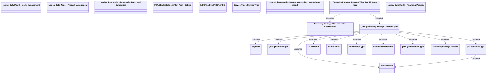

# Financing Package Criterion

```mermaid
classDiagram
    class Segment["Segment"]
    class Logical_Data_Model_Model_Management["Logical Data Model : Model Management"]
    class Logical_Data_Model_Product_Management["Logical Data Model : Product Management"]
    class Logical_Data_Model_Commodity_Types_and_Categories["Logical Data Model : Commodity Types and Categories"]
    class IPPACK_Installment_Plan_Pack_Setting["IPPACK : Installment Plan Pack - Setting"]
    class INSURANCE_INSURANCE["INSURANCE : INSURANCE"]
    class Service_Type_Service_Type["Service Type : Service Type"]
    class Logical_data_model_Account_transaction_Logical_data_model["Logical data model : Account transaction - Logical data model"]
    class Service_Level["Service Level"]
    class MOD_Insurance_type["{MOD}Insurance type"]
    class MOD_Service_type["{MOD}Service type"]
    class ADD_Model["{ADD}Model"]
    class Financing_Package_Criterion_Value_Combination_Item["Financing Package Criterion Value Combination Item"]
    class Financing_Package_Criterion_Value_Combination["Financing Package Criterion Value Combination"]
    class Manufacturer["Manufacturer"]
    class Commodity_Type["Commodity Type"]
    class Get_List_of_Merchants["Get List of Merchants"]
    class MOD_Transaction_Type["{MOD}Transaction Type"]
    class Financing_Package_Purpose["Financing Package Purpose"]
    class MOD_Financing_Package_Criterion_Type["{MOD}Financing Package Criterion Type"]
    class Logical_Data_Model_Financing_Package["Logical Data Model : Financing Package"]
    Financing_Package_Criterion_Value_Combination_Item --> MOD_Financing_Package_Criterion_Type : unnamed
    MOD_Financing_Package_Criterion_Type --> Financing_Package_Purpose : unnamed
    MOD_Financing_Package_Criterion_Type --> MOD_Transaction_Type : unnamed
    MOD_Financing_Package_Criterion_Type --> Get_List_of_Merchants : unnamed
    MOD_Financing_Package_Criterion_Type --> Commodity_Type : unnamed
    MOD_Financing_Package_Criterion_Type --> Manufacturer : unnamed
    Financing_Package_Criterion_Value_Combination_Item --> Financing_Package_Criterion_Value_Combination : unnamed
    MOD_Financing_Package_Criterion_Type --> ADD_Model : unnamed
    MOD_Financing_Package_Criterion_Type --> MOD_Service_type : unnamed
    MOD_Financing_Package_Criterion_Type --> MOD_Insurance_type : unnamed
    MOD_Financing_Package_Criterion_Type --> Service_Level : unnamed
    MOD_Service_type --> Service_Level : unnamed
    MOD_Financing_Package_Criterion_Type --> Segment : unnamed
```
