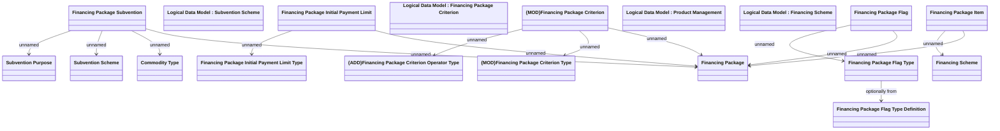

# Financing Package

```mermaid
classDiagram
    class ADD_Financing_Package_Criterion_Operator_Type["{ADD}Financing Package Criterion Operator Type"]
    class Subvention_Purpose["Subvention Purpose"]
    class Financing_Package_Initial_Payment_Limit_Type["Financing Package Initial Payment Limit Type"]
    class Financing_Package_Initial_Payment_Limit["Financing Package Initial Payment Limit"]
    class Logical_Data_Model_Subvention_Scheme["Logical Data Model : Subvention Scheme"]
    class Subvention_Scheme["Subvention Scheme"]
    class Commodity_Type["Commodity Type"]
    class Financing_Package_Subvention["Financing Package Subvention"]
    class Logical_Data_Model_Financing_Package_Criterion["Logical Data Model : Financing Package Criterion"]
    class Financing_Package_Flag_Type["Financing Package Flag Type"]
    class Financing_Package_Flag_Type_Definition["Financing Package Flag Type Definition"]
    class Financing_Package_Flag["Financing Package Flag"]
    class Logical_Data_Model_Product_Management["Logical Data Model : Product Management"]
    class Logical_Data_Model_Financing_Scheme["Logical Data Model : Financing Scheme"]
    class MOD_Financing_Package_Criterion["{MOD}Financing Package Criterion"]
    class Financing_Package_Item["Financing Package Item"]
    class Financing_Scheme["Financing Scheme"]
    class MOD_Financing_Package_Criterion_Type["{MOD}Financing Package Criterion Type"]
    class Financing_Package["Financing Package"]
    MOD_Financing_Package_Criterion --> Financing_Package : unnamed
    Financing_Package_Item --> Financing_Package : unnamed
    Financing_Package_Initial_Payment_Limit --> Financing_Package : unnamed
    Financing_Package_Flag --> Financing_Package : unnamed
    Financing_Package_Subvention --> Financing_Package : unnamed
    MOD_Financing_Package_Criterion --> MOD_Financing_Package_Criterion_Type : unnamed
    Financing_Package_Item --> Financing_Scheme : unnamed
    Financing_Package_Flag_Type --> Financing_Package_Flag_Type_Definition : optionally from
    Financing_Package_Flag --> Financing_Package_Flag_Type : unnamed
    Financing_Package_Subvention --> Commodity_Type : unnamed
    Financing_Package_Subvention --> Subvention_Scheme : unnamed
    Financing_Package_Initial_Payment_Limit --> Financing_Package_Initial_Payment_Limit_Type : unnamed
    Financing_Package_Subvention --> Subvention_Purpose : unnamed
    MOD_Financing_Package_Criterion --> ADD_Financing_Package_Criterion_Operator_Type : unnamed
```
