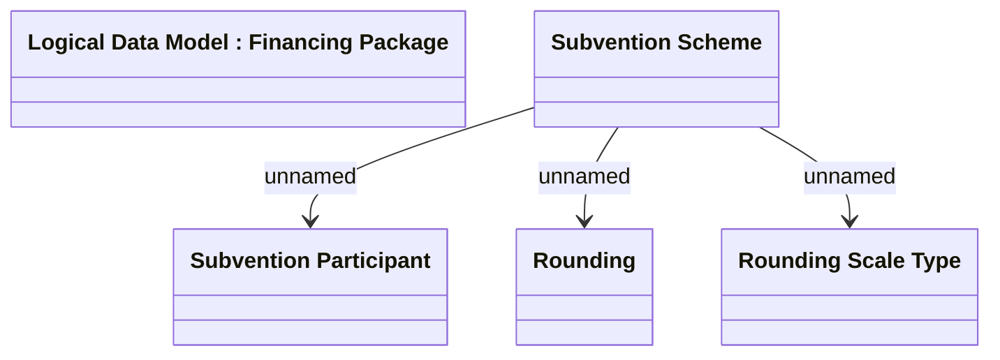

# Subvention Scheme

```mermaid
classDiagram
    class Rounding_Scale_Type["Rounding Scale Type"]
    class Rounding["Rounding"]
    class Subvention_Participant["Subvention Participant"]
    class Logical_Data_Model_Financing_Package["Logical Data Model : Financing Package"]
    class Subvention_Scheme["Subvention Scheme"]
    Subvention_Scheme --> Subvention_Participant : unnamed
    Subvention_Scheme --> Rounding : unnamed
    Subvention_Scheme --> Rounding_Scale_Type : unnamed
```
