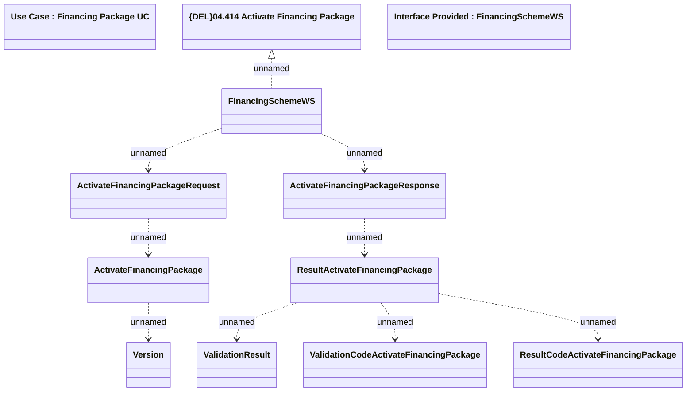

# ActivateFinancingPackage

- **Diagram Type**: Logical
- **Package**: HomerSelect/BSL/Modules/Product Catalog (PRC)/Analytical Model/Financing Scheme/Financing Package/Provided Services/Interface Provided/ActivateFinancingPackage
- **Diagram ID**: 102272
- **Elements**: 12
- **Connectors**: 9

