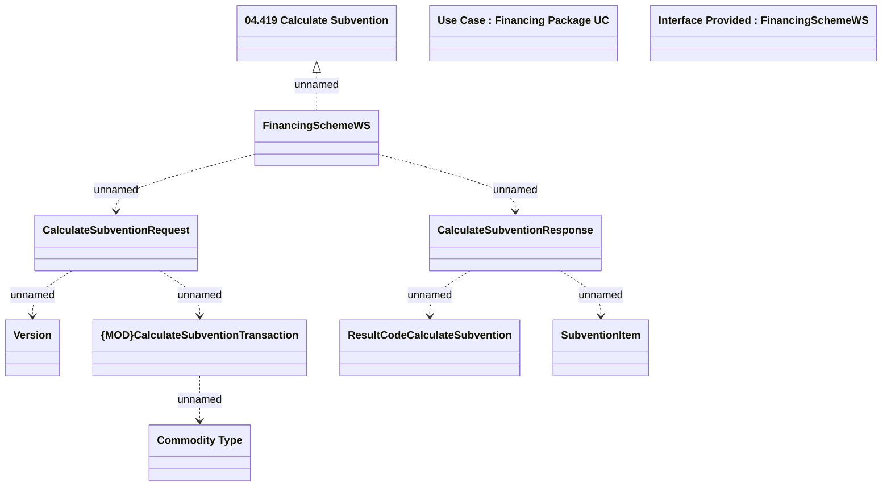

# CalculateSubvention

- **Diagram Type**: Logical
- **Package**: HomerSelect/BSL/Modules/Product Catalog (PRC)/Analytical Model/Financing Scheme/Financing Package/Provided Services/Interface Provided/CalculateSubvention
- **Diagram ID**: 126623
- **Elements**: 11
- **Connectors**: 8

