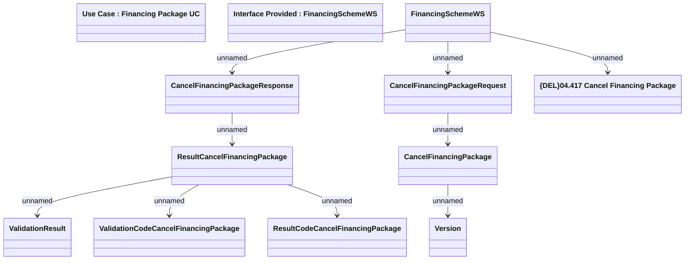

# CancelFinancingPackage

```mermaid
classDiagram
    class ResultCodeCancelFinancingPackage["ResultCodeCancelFinancingPackage"]
    class ValidationCodeCancelFinancingPackage["ValidationCodeCancelFinancingPackage"]
    class ResultCancelFinancingPackage["ResultCancelFinancingPackage"]
    class CancelFinancingPackageResponse["CancelFinancingPackageResponse"]
    class CancelFinancingPackage["CancelFinancingPackage"]
    class CancelFinancingPackageRequest["CancelFinancingPackageRequest"]
    class Use_Case_Financing_Package_UC["Use Case : Financing Package UC"]
    class DEL_04_417_Cancel_Financing_Package["{DEL}04.417 Cancel Financing Package"]
    class ValidationResult["ValidationResult"]
    class Interface_Provided_FinancingSchemeWS["Interface Provided : FinancingSchemeWS"]
    class Version["Version"]
    class FinancingSchemeWS["FinancingSchemeWS"]
    CancelFinancingPackage --> Version : unnamed
    ResultCancelFinancingPackage --> ValidationResult : unnamed
    CancelFinancingPackageRequest --> CancelFinancingPackage : unnamed
    CancelFinancingPackageResponse --> ResultCancelFinancingPackage : unnamed
    ResultCancelFinancingPackage --> ValidationCodeCancelFinancingPackage : unnamed
    ResultCancelFinancingPackage --> ResultCodeCancelFinancingPackage : unnamed
    FinancingSchemeWS --> CancelFinancingPackageResponse : unnamed
    FinancingSchemeWS --> CancelFinancingPackageRequest : unnamed
    FinancingSchemeWS --> DEL_04_417_Cancel_Financing_Package : unnamed
```
