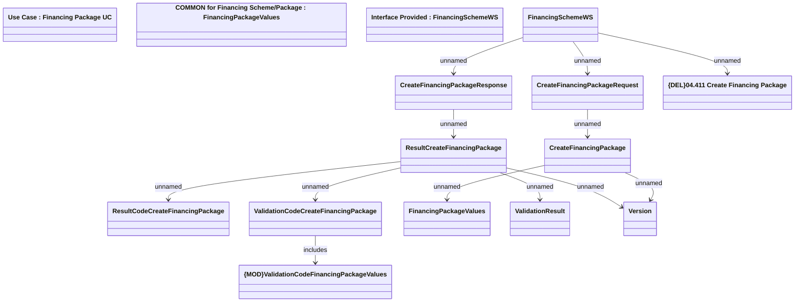

# CreateFinancingPackage

```mermaid
classDiagram
    class Use_Case_Financing_Package_UC["Use Case : Financing Package UC"]
    class ResultCodeCreateFinancingPackage["ResultCodeCreateFinancingPackage"]
    class ValidationCodeCreateFinancingPackage["ValidationCodeCreateFinancingPackage"]
    class MOD_ValidationCodeFinancingPackageValues["{MOD}ValidationCodeFinancingPackageValues"]
    class ResultCreateFinancingPackage["ResultCreateFinancingPackage"]
    class CreateFinancingPackageResponse["CreateFinancingPackageResponse"]
    class COMMON_for_Financing_Scheme_Package_FinancingPackageValues["COMMON for Financing Scheme/Package : FinancingPackageValues"]
    class FinancingPackageValues["FinancingPackageValues"]
    class CreateFinancingPackage["CreateFinancingPackage"]
    class CreateFinancingPackageRequest["CreateFinancingPackageRequest"]
    class DEL_04_411_Create_Financing_Package["{DEL}04.411 Create Financing Package"]
    class ValidationResult["ValidationResult"]
    class Interface_Provided_FinancingSchemeWS["Interface Provided : FinancingSchemeWS"]
    class Version["Version"]
    class FinancingSchemeWS["FinancingSchemeWS"]
    ResultCreateFinancingPackage --> Version : unnamed
    CreateFinancingPackage --> Version : unnamed
    ResultCreateFinancingPackage --> ValidationResult : unnamed
    CreateFinancingPackageRequest --> CreateFinancingPackage : unnamed
    CreateFinancingPackage --> FinancingPackageValues : unnamed
    CreateFinancingPackageResponse --> ResultCreateFinancingPackage : unnamed
    ValidationCodeCreateFinancingPackage --> MOD_ValidationCodeFinancingPackageValues : includes
    ResultCreateFinancingPackage --> ValidationCodeCreateFinancingPackage : unnamed
    ResultCreateFinancingPackage --> ResultCodeCreateFinancingPackage : unnamed
    FinancingSchemeWS --> DEL_04_411_Create_Financing_Package : unnamed
    FinancingSchemeWS --> CreateFinancingPackageResponse : unnamed
    FinancingSchemeWS --> CreateFinancingPackageRequest : unnamed
```
