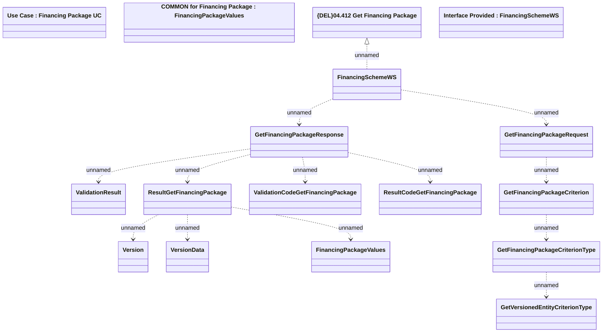

# GetFinancingPackage

- **Diagram Type**: Logical
- **Package**: HomerSelect/BSL/Modules/Product Catalog (PRC)/Analytical Model/Financing Scheme/Financing Package/Provided Services/Interface Provided/GetFinancingPackage
- **Diagram ID**: 97504
- **Elements**: 17
- **Connectors**: 13

