# GetFinancingPackageCodeLists

- **Diagram Type**: Logical
- **Package**: HomerSelect/BSL/Modules/Product Catalog (PRC)/Analytical Model/Financing Scheme/Financing Package/Provided Services/Interface Provided/GetFinancingPackageCodeLists
- **Diagram ID**: 126620
- **Elements**: 31
- **Connectors**: 27

```mermaid
classDiagram
    class Subvention_Purpose["Subvention Purpose"]
    class ADD_SubventionPurpose["{ADD}SubventionPurpose"]
    class FinancingPackageInitialPaymentLimit["FinancingPackageInitialPaymentLimit"]
    class Subvention_Scheme["Subvention Scheme"]
    class SubventionScheme["SubventionScheme"]
    class FinancingPackageFlagType["FinancingPackageFlagType"]
    class Financing_Package_Flag_Type["Financing Package Flag Type"]
    class ErrorCodeGetFinancingPackageCodeLists["ErrorCodeGetFinancingPackageCodeLists"]
    class FinancingScheme["FinancingScheme"]
    class Manufacturer["Manufacturer"]
    class Commodity_Category["Commodity Category"]
    class CommodityCategory["CommodityCategory"]
    class CommodityType["CommodityType"]
    class TransactionType["TransactionType"]
    class FinancingPackagePurpose["FinancingPackagePurpose"]
    class Merchant["Merchant"]
    class FinancingPackageCriterionType["FinancingPackageCriterionType"]
    class Financing_Scheme["Financing Scheme"]
    class MOD_Financing_Package_Criterion_Type["{MOD}Financing Package Criterion Type"]
    class Commodity_Type["Commodity Type"]
    class Financing_Package_Purpose["Financing Package Purpose"]
    class Manufacturer["Manufacturer"]
    class Get_List_of_Merchants["Get List of Merchants"]
    class MOD_Transaction_Type["{MOD}Transaction Type"]
    class Use_Case_Financing_Package_UC["Use Case : Financing Package UC"]
    class DEL_04_415_Get_Financing_Package_Code_Lists["{DEL}04.415 Get Financing Package Code Lists"]
    class GetFinancingPackageCodeListsResponse["GetFinancingPackageCodeListsResponse"]
    class Interface_Provided_FinancingSchemeWS["Interface Provided : FinancingSchemeWS"]
    class FinancingSchemeWS["FinancingSchemeWS"]
    class Financing_Package_Initial_Payment_Limit_Type["Financing Package Initial Payment Limit Type"]
    GetFinancingPackageCodeListsResponse ..> Manufacturer : unnamed
    GetFinancingPackageCodeListsResponse ..> Merchant : unnamed
    GetFinancingPackageCodeListsResponse ..> FinancingPackagePurpose : unnamed
    GetFinancingPackageCodeListsResponse ..> TransactionType : unnamed
    GetFinancingPackageCodeListsResponse ..> CommodityType : unnamed
    GetFinancingPackageCodeListsResponse ..> CommodityCategory : unnamed
    GetFinancingPackageCodeListsResponse ..> FinancingPackageInitialPaymentLimit : unnamed
    CommodityCategory ..> Commodity_Category : unnamed
    FinancingPackageCriterionType ..> MOD_Financing_Package_Criterion_Type : unnamed
    GetFinancingPackageCodeListsResponse ..> FinancingScheme : unnamed
    GetFinancingPackageCodeListsResponse ..> ErrorCodeGetFinancingPackageCodeLists : unnamed
    FinancingPackageFlagType ..> Financing_Package_Flag_Type : unnamed
    GetFinancingPackageCodeListsResponse ..> FinancingPackageFlagType : unnamed
    GetFinancingPackageCodeListsResponse ..> SubventionScheme : unnamed
    SubventionScheme ..> Subvention_Scheme : unnamed
    Manufacturer ..> Manufacturer : unnamed
    GetFinancingPackageCodeListsResponse ..> ADD_SubventionPurpose : unnamed
    FinancingPackageInitialPaymentLimit ..> Financing_Package_Initial_Payment_Limit_Type : unnamed
    FinancingSchemeWS ..> GetFinancingPackageCodeListsResponse : unnamed
    DEL_04_415_Get_Financing_Package_Code_Lists <|.. FinancingSchemeWS : unnamed
    TransactionType ..> MOD_Transaction_Type : unnamed
    GetFinancingPackageCodeListsResponse ..> FinancingPackageCriterionType : unnamed
    Merchant ..> Get_List_of_Merchants : unnamed
    FinancingScheme ..> Financing_Scheme : unnamed
    FinancingPackagePurpose ..> Financing_Package_Purpose : unnamed
    CommodityType ..> Commodity_Type : unnamed
    ADD_SubventionPurpose ..> Subvention_Purpose : unnamed
```

