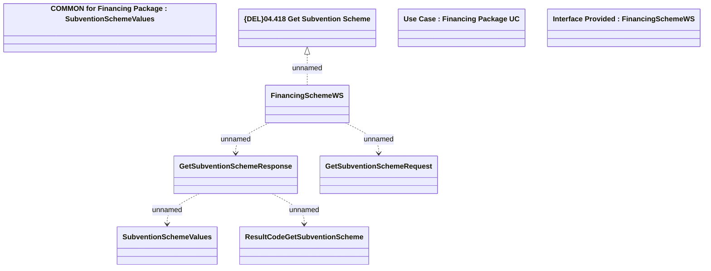

# GetSubventionScheme

- **Diagram Type**: Logical
- **Package**: HomerSelect/BSL/Modules/Product Catalog (PRC)/Analytical Model/Financing Scheme/Financing Package/Provided Services/Interface Provided/GetSubventionScheme
- **Diagram ID**: 102730
- **Elements**: 9
- **Connectors**: 5

