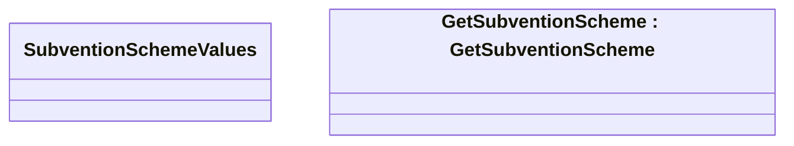

# SubventionSchemeValues

- **Diagram Type**: Logical
- **Package**: HomerSelect/BSL/Modules/Product Catalog (PRC)/Analytical Model/Financing Scheme/Financing Package/Provided Services/Interface Provided/COMMON for Financing Package
- **Diagram ID**: 138385
- **Elements**: 2
- **Connectors**: 0

