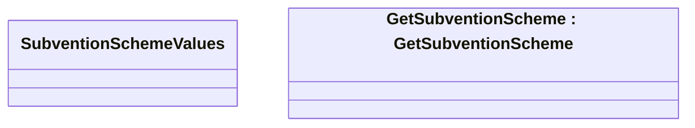

# SubventionSchemeValues

```mermaid
classDiagram
    class SubventionSchemeValues["SubventionSchemeValues"]
    class GetSubventionScheme_GetSubventionScheme["GetSubventionScheme : GetSubventionScheme"]
```
