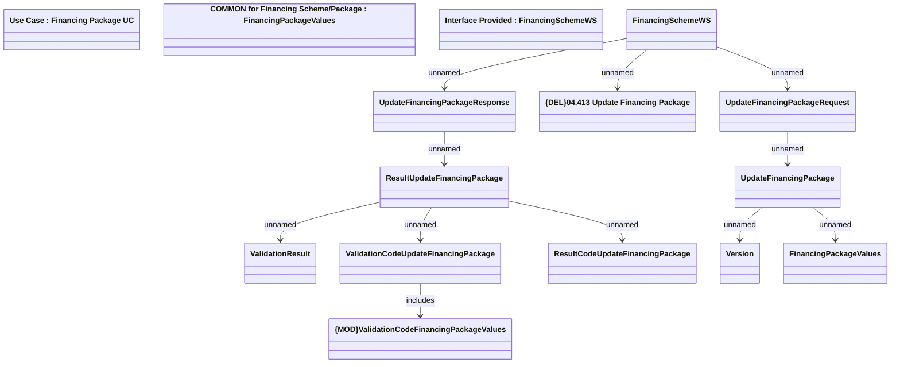

# UpdateFinancingPackage

```mermaid
classDiagram
    class MOD_ValidationCodeFinancingPackageValues["{MOD}ValidationCodeFinancingPackageValues"]
    class ResultCodeUpdateFinancingPackage["ResultCodeUpdateFinancingPackage"]
    class ValidationCodeUpdateFinancingPackage["ValidationCodeUpdateFinancingPackage"]
    class ResultUpdateFinancingPackage["ResultUpdateFinancingPackage"]
    class UpdateFinancingPackageResponse["UpdateFinancingPackageResponse"]
    class Use_Case_Financing_Package_UC["Use Case : Financing Package UC"]
    class DEL_04_413_Update_Financing_Package["{DEL}04.413 Update Financing Package"]
    class UpdateFinancingPackage["UpdateFinancingPackage"]
    class UpdateFinancingPackageRequest["UpdateFinancingPackageRequest"]
    class COMMON_for_Financing_Scheme_Package_FinancingPackageValues["COMMON for Financing Scheme/Package : FinancingPackageValues"]
    class FinancingPackageValues["FinancingPackageValues"]
    class ValidationResult["ValidationResult"]
    class Interface_Provided_FinancingSchemeWS["Interface Provided : FinancingSchemeWS"]
    class Version["Version"]
    class FinancingSchemeWS["FinancingSchemeWS"]
    UpdateFinancingPackage --> Version : unnamed
    ResultUpdateFinancingPackage --> ValidationResult : unnamed
    UpdateFinancingPackage --> FinancingPackageValues : unnamed
    UpdateFinancingPackageRequest --> UpdateFinancingPackage : unnamed
    UpdateFinancingPackageResponse --> ResultUpdateFinancingPackage : unnamed
    ResultUpdateFinancingPackage --> ValidationCodeUpdateFinancingPackage : unnamed
    ResultUpdateFinancingPackage --> ResultCodeUpdateFinancingPackage : unnamed
    ValidationCodeUpdateFinancingPackage --> MOD_ValidationCodeFinancingPackageValues : includes
    FinancingSchemeWS --> UpdateFinancingPackageResponse : unnamed
    FinancingSchemeWS --> DEL_04_413_Update_Financing_Package : unnamed
    FinancingSchemeWS --> UpdateFinancingPackageRequest : unnamed
```
