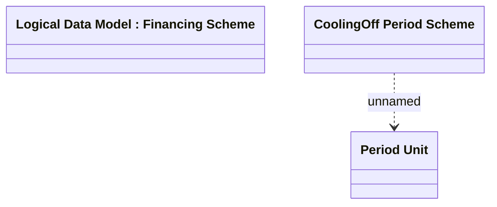

# CoolingOff Period Scheme

- **Diagram Type**: Logical
- **Package**: HomerSelect/BSL/Modules/Product Catalog (PRC)/Analytical Model/Financing Scheme/Financing Scheme/Logical Data Model
- **Diagram ID**: 142597
- **Elements**: 3
- **Connectors**: 1

