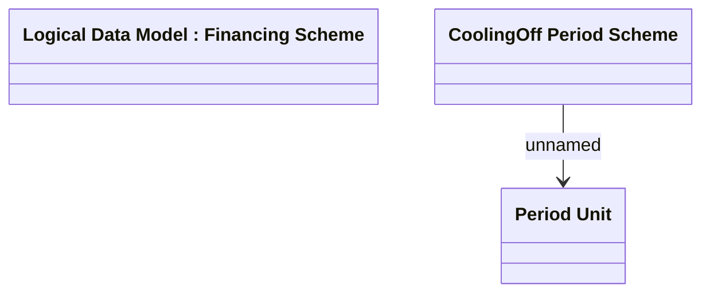

# CoolingOff Period Scheme

```mermaid
classDiagram
    class Logical_Data_Model_Financing_Scheme["Logical Data Model : Financing Scheme"]
    class Period_Unit["Period Unit"]
    class CoolingOff_Period_Scheme["CoolingOff Period Scheme"]
    CoolingOff_Period_Scheme --> Period_Unit : unnamed
```
