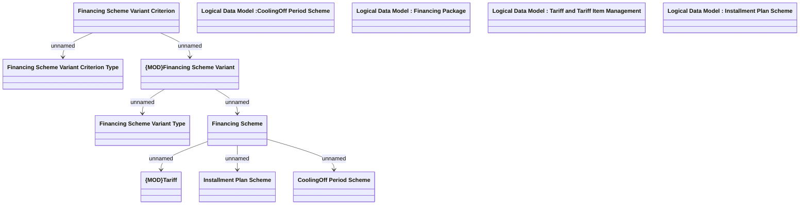

# Financing Scheme

```mermaid
classDiagram
    class Financing_Scheme_Variant_Criterion["Financing Scheme Variant Criterion"]
    class Financing_Scheme_Variant_Criterion_Type["Financing Scheme Variant Criterion Type"]
    class Logical_Data_Model_CoolingOff_Period_Scheme["Logical Data Model :CoolingOff Period Scheme"]
    class CoolingOff_Period_Scheme["CoolingOff Period Scheme"]
    class Logical_Data_Model_Financing_Package["Logical Data Model : Financing Package"]
    class Logical_Data_Model_Tariff_and_Tariff_Item_Management["Logical Data Model : Tariff and Tariff Item Management"]
    class Logical_Data_Model_Installment_Plan_Scheme["Logical Data Model : Installment Plan Scheme"]
    class Installment_Plan_Scheme["Installment Plan Scheme"]
    class Financing_Scheme_Variant_Type["Financing Scheme Variant Type"]
    class Financing_Scheme["Financing Scheme"]
    class MOD_Tariff["{MOD}Tariff"]
    class MOD_Financing_Scheme_Variant["{MOD}Financing Scheme Variant"]
    Financing_Scheme_Variant_Criterion --> MOD_Financing_Scheme_Variant : unnamed
    Financing_Scheme --> MOD_Tariff : unnamed
    MOD_Financing_Scheme_Variant --> Financing_Scheme : unnamed
    MOD_Financing_Scheme_Variant --> Financing_Scheme_Variant_Type : unnamed
    Financing_Scheme --> Installment_Plan_Scheme : unnamed
    Financing_Scheme --> CoolingOff_Period_Scheme : unnamed
    Financing_Scheme_Variant_Criterion --> Financing_Scheme_Variant_Criterion_Type : unnamed
```
