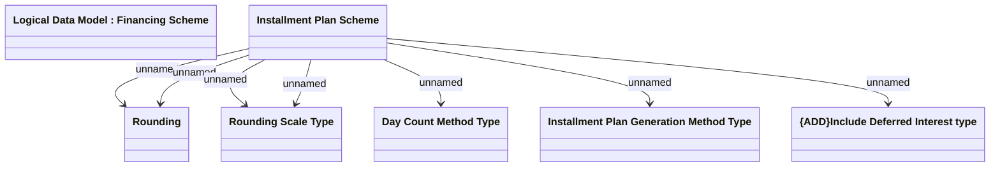

# Installment Plan Scheme

```mermaid
classDiagram
    class ADD_Include_Deferred_Interest_type["{ADD}Include Deferred Interest type"]
    class Logical_Data_Model_Financing_Scheme["Logical Data Model : Financing Scheme"]
    class Installment_Plan_Generation_Method_Type["Installment Plan Generation Method Type"]
    class Day_Count_Method_Type["Day Count Method Type"]
    class Installment_Plan_Scheme["Installment Plan Scheme"]
    class Rounding_Scale_Type["Rounding Scale Type"]
    class Rounding["Rounding"]
    Installment_Plan_Scheme --> Rounding : unnamed
    Installment_Plan_Scheme --> Rounding : unnamed
    Installment_Plan_Scheme --> Rounding_Scale_Type : unnamed
    Installment_Plan_Scheme --> Rounding_Scale_Type : unnamed
    Installment_Plan_Scheme --> Day_Count_Method_Type : unnamed
    Installment_Plan_Scheme --> Installment_Plan_Generation_Method_Type : unnamed
    Installment_Plan_Scheme --> ADD_Include_Deferred_Interest_type : unnamed
```
