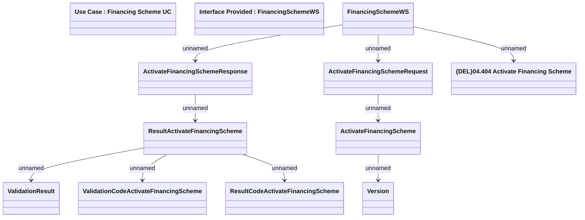

# ActivateFinancingScheme

```mermaid
classDiagram
    class ResultCodeActivateFinancingScheme["ResultCodeActivateFinancingScheme"]
    class ValidationCodeActivateFinancingScheme["ValidationCodeActivateFinancingScheme"]
    class ResultActivateFinancingScheme["ResultActivateFinancingScheme"]
    class ActivateFinancingScheme["ActivateFinancingScheme"]
    class ActivateFinancingSchemeResponse["ActivateFinancingSchemeResponse"]
    class ActivateFinancingSchemeRequest["ActivateFinancingSchemeRequest"]
    class DEL_04_404_Activate_Financing_Scheme["{DEL}04.404 Activate Financing Scheme"]
    class ValidationResult["ValidationResult"]
    class Use_Case_Financing_Scheme_UC["Use Case : Financing Scheme UC"]
    class Interface_Provided_FinancingSchemeWS["Interface Provided : FinancingSchemeWS"]
    class Version["Version"]
    class FinancingSchemeWS["FinancingSchemeWS"]
    FinancingSchemeWS --> ActivateFinancingSchemeResponse : unnamed
    FinancingSchemeWS --> DEL_04_404_Activate_Financing_Scheme : unnamed
    FinancingSchemeWS --> ActivateFinancingSchemeRequest : unnamed
    ActivateFinancingScheme --> Version : unnamed
    ResultActivateFinancingScheme --> ValidationResult : unnamed
    ActivateFinancingSchemeRequest --> ActivateFinancingScheme : unnamed
    ActivateFinancingSchemeResponse --> ResultActivateFinancingScheme : unnamed
    ResultActivateFinancingScheme --> ValidationCodeActivateFinancingScheme : unnamed
    ResultActivateFinancingScheme --> ResultCodeActivateFinancingScheme : unnamed
```
