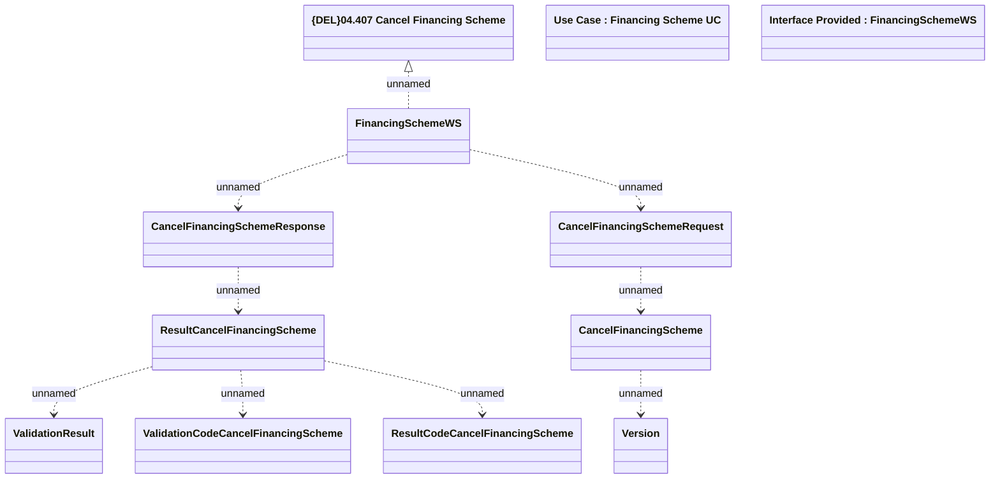

# CancelFinancingScheme

- **Diagram Type**: Logical
- **Package**: HomerSelect/BSL/Modules/Product Catalog (PRC)/Analytical Model/Financing Scheme/Financing Scheme/Provided Services/Interface Provided/CancelFinancingScheme
- **Diagram ID**: 96792
- **Elements**: 12
- **Connectors**: 9

