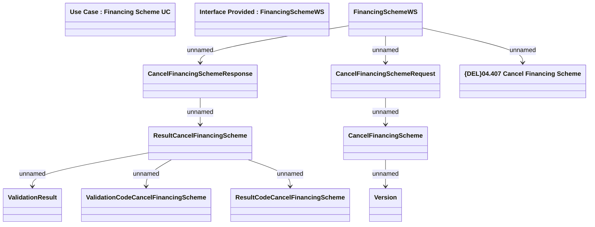

# CancelFinancingScheme

```mermaid
classDiagram
    class ResultCodeCancelFinancingScheme["ResultCodeCancelFinancingScheme"]
    class ValidationCodeCancelFinancingScheme["ValidationCodeCancelFinancingScheme"]
    class ResultCancelFinancingScheme["ResultCancelFinancingScheme"]
    class CancelFinancingSchemeResponse["CancelFinancingSchemeResponse"]
    class CancelFinancingScheme["CancelFinancingScheme"]
    class CancelFinancingSchemeRequest["CancelFinancingSchemeRequest"]
    class DEL_04_407_Cancel_Financing_Scheme["{DEL}04.407 Cancel Financing Scheme"]
    class ValidationResult["ValidationResult"]
    class Use_Case_Financing_Scheme_UC["Use Case : Financing Scheme UC"]
    class Interface_Provided_FinancingSchemeWS["Interface Provided : FinancingSchemeWS"]
    class Version["Version"]
    class FinancingSchemeWS["FinancingSchemeWS"]
    CancelFinancingScheme --> Version : unnamed
    ResultCancelFinancingScheme --> ValidationResult : unnamed
    CancelFinancingSchemeRequest --> CancelFinancingScheme : unnamed
    CancelFinancingSchemeResponse --> ResultCancelFinancingScheme : unnamed
    ResultCancelFinancingScheme --> ValidationCodeCancelFinancingScheme : unnamed
    ResultCancelFinancingScheme --> ResultCodeCancelFinancingScheme : unnamed
    FinancingSchemeWS --> DEL_04_407_Cancel_Financing_Scheme : unnamed
    FinancingSchemeWS --> CancelFinancingSchemeResponse : unnamed
    FinancingSchemeWS --> CancelFinancingSchemeRequest : unnamed
```
