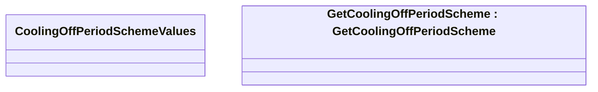

# CoolingOffPeriodSchemeValues

```mermaid
classDiagram
    class CoolingOffPeriodSchemeValues["CoolingOffPeriodSchemeValues"]
    class GetCoolingOffPeriodScheme_GetCoolingOffPeriodScheme["GetCoolingOffPeriodScheme : GetCoolingOffPeriodScheme"]
```
