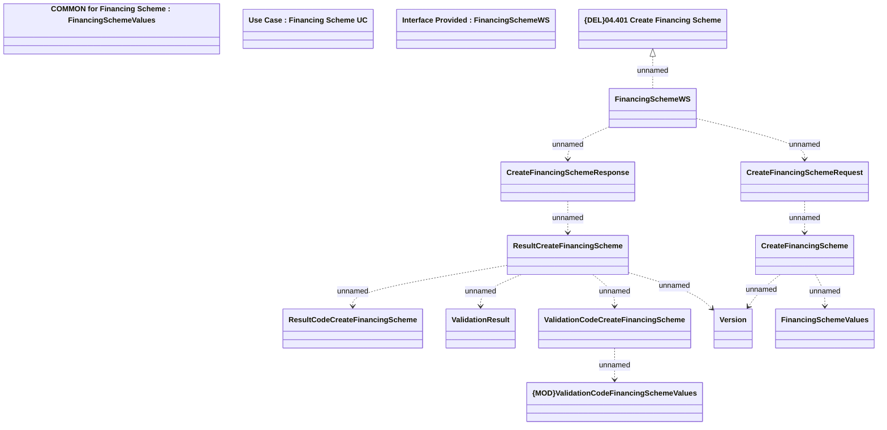

# CreateFinancingScheme

- **Diagram Type**: Logical
- **Package**: HomerSelect/BSL/Modules/Product Catalog (PRC)/Analytical Model/Financing Scheme/Financing Scheme/Provided Services/Interface Provided/CreateFinancingScheme
- **Diagram ID**: 96696
- **Elements**: 15
- **Connectors**: 12

