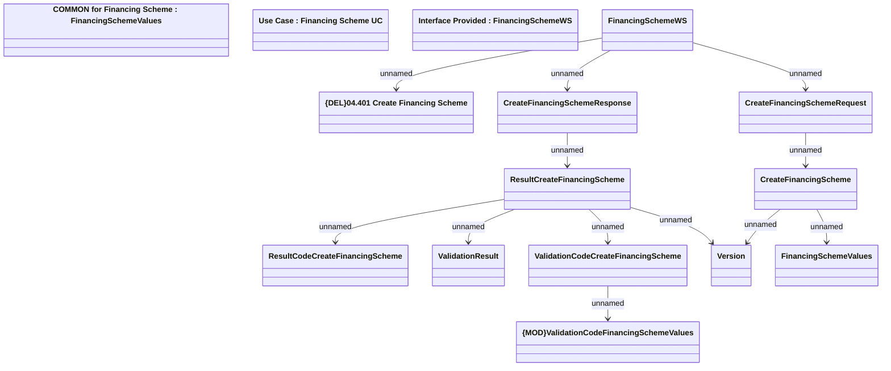

# CreateFinancingScheme

```mermaid
classDiagram
    class ResultCodeCreateFinancingScheme["ResultCodeCreateFinancingScheme"]
    class ValidationResult["ValidationResult"]
    class ValidationCodeCreateFinancingScheme["ValidationCodeCreateFinancingScheme"]
    class COMMON_for_Financing_Scheme_FinancingSchemeValues["COMMON for Financing Scheme : FinancingSchemeValues"]
    class Use_Case_Financing_Scheme_UC["Use Case : Financing Scheme UC"]
    class Interface_Provided_FinancingSchemeWS["Interface Provided : FinancingSchemeWS"]
    class DEL_04_401_Create_Financing_Scheme["{DEL}04.401 Create Financing Scheme"]
    class Version["Version"]
    class MOD_ValidationCodeFinancingSchemeValues["{MOD}ValidationCodeFinancingSchemeValues"]
    class FinancingSchemeValues["FinancingSchemeValues"]
    class ResultCreateFinancingScheme["ResultCreateFinancingScheme"]
    class CreateFinancingScheme["CreateFinancingScheme"]
    class CreateFinancingSchemeResponse["CreateFinancingSchemeResponse"]
    class CreateFinancingSchemeRequest["CreateFinancingSchemeRequest"]
    class FinancingSchemeWS["FinancingSchemeWS"]
    CreateFinancingSchemeRequest --> CreateFinancingScheme : unnamed
    CreateFinancingSchemeResponse --> ResultCreateFinancingScheme : unnamed
    CreateFinancingScheme --> FinancingSchemeValues : unnamed
    ValidationCodeCreateFinancingScheme --> MOD_ValidationCodeFinancingSchemeValues : unnamed
    ResultCreateFinancingScheme --> Version : unnamed
    CreateFinancingScheme --> Version : unnamed
    ResultCreateFinancingScheme --> ValidationCodeCreateFinancingScheme : unnamed
    ResultCreateFinancingScheme --> ValidationResult : unnamed
    ResultCreateFinancingScheme --> ResultCodeCreateFinancingScheme : unnamed
    FinancingSchemeWS --> CreateFinancingSchemeResponse : unnamed
    FinancingSchemeWS --> CreateFinancingSchemeRequest : unnamed
    FinancingSchemeWS --> DEL_04_401_Create_Financing_Scheme : unnamed
```
