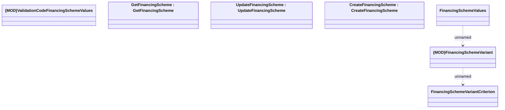

# FinancingSchemeValues

- **Diagram Type**: Logical
- **Package**: HomerSelect/BSL/Modules/Product Catalog (PRC)/Analytical Model/Financing Scheme/Financing Scheme/Provided Services/Interface Provided/COMMON for Financing Scheme
- **Diagram ID**: 124686
- **Elements**: 7
- **Connectors**: 2

