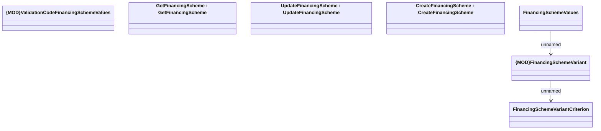

# FinancingSchemeValues

```mermaid
classDiagram
    class MOD_ValidationCodeFinancingSchemeValues["{MOD}ValidationCodeFinancingSchemeValues"]
    class FinancingSchemeVariantCriterion["FinancingSchemeVariantCriterion"]
    class GetFinancingScheme_GetFinancingScheme["GetFinancingScheme : GetFinancingScheme"]
    class UpdateFinancingScheme_UpdateFinancingScheme["UpdateFinancingScheme : UpdateFinancingScheme"]
    class CreateFinancingScheme_CreateFinancingScheme["CreateFinancingScheme : CreateFinancingScheme"]
    class FinancingSchemeValues["FinancingSchemeValues"]
    class MOD_FinancingSchemeVariant["{MOD}FinancingSchemeVariant"]
    FinancingSchemeValues --> MOD_FinancingSchemeVariant : unnamed
    MOD_FinancingSchemeVariant --> FinancingSchemeVariantCriterion : unnamed
```
