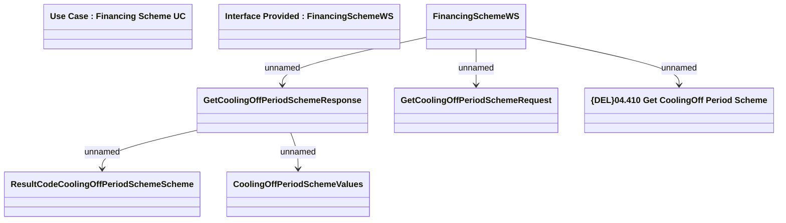

# GetCoolingOffPeriodScheme

```mermaid
classDiagram
    class CoolingOffPeriodSchemeValues["CoolingOffPeriodSchemeValues"]
    class ResultCodeCoolingOffPeriodSchemeScheme["ResultCodeCoolingOffPeriodSchemeScheme"]
    class GetCoolingOffPeriodSchemeResponse["GetCoolingOffPeriodSchemeResponse"]
    class GetCoolingOffPeriodSchemeRequest["GetCoolingOffPeriodSchemeRequest"]
    class DEL_04_410_Get_CoolingOff_Period_Scheme["{DEL}04.410 Get CoolingOff Period Scheme"]
    class Use_Case_Financing_Scheme_UC["Use Case : Financing Scheme UC"]
    class Interface_Provided_FinancingSchemeWS["Interface Provided : FinancingSchemeWS"]
    class FinancingSchemeWS["FinancingSchemeWS"]
    GetCoolingOffPeriodSchemeResponse --> ResultCodeCoolingOffPeriodSchemeScheme : unnamed
    GetCoolingOffPeriodSchemeResponse --> CoolingOffPeriodSchemeValues : unnamed
    FinancingSchemeWS --> DEL_04_410_Get_CoolingOff_Period_Scheme : unnamed
    FinancingSchemeWS --> GetCoolingOffPeriodSchemeResponse : unnamed
    FinancingSchemeWS --> GetCoolingOffPeriodSchemeRequest : unnamed
```
