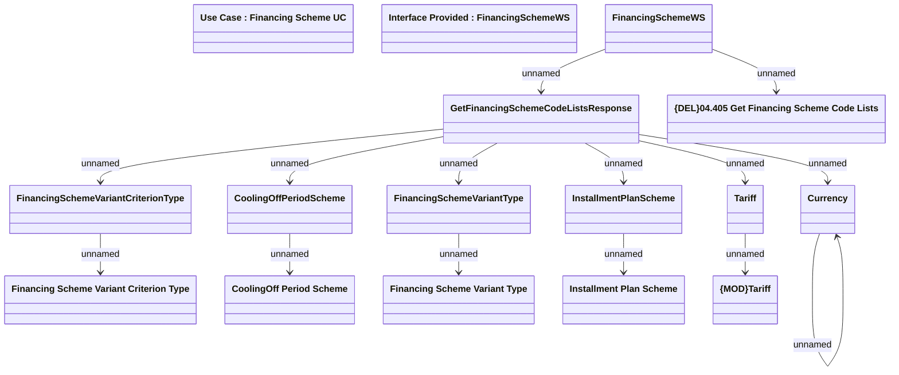

# GetFinancingSchemeCodeLists

```mermaid
classDiagram
    class FinancingSchemeVariantCriterionType["FinancingSchemeVariantCriterionType"]
    class Financing_Scheme_Variant_Criterion_Type["Financing Scheme Variant Criterion Type"]
    class CoolingOff_Period_Scheme["CoolingOff Period Scheme"]
    class CoolingOffPeriodScheme["CoolingOffPeriodScheme"]
    class FinancingSchemeVariantType["FinancingSchemeVariantType"]
    class Financing_Scheme_Variant_Type["Financing Scheme Variant Type"]
    class Tariff["Tariff"]
    class Installment_Plan_Scheme["Installment Plan Scheme"]
    class MOD_Tariff["{MOD}Tariff"]
    class InstallmentPlanScheme["InstallmentPlanScheme"]
    class Currency["Currency"]
    class GetFinancingSchemeCodeListsResponse["GetFinancingSchemeCodeListsResponse"]
    class DEL_04_405_Get_Financing_Scheme_Code_Lists["{DEL}04.405 Get Financing Scheme Code Lists"]
    class Use_Case_Financing_Scheme_UC["Use Case : Financing Scheme UC"]
    class Interface_Provided_FinancingSchemeWS["Interface Provided : FinancingSchemeWS"]
    class FinancingSchemeWS["FinancingSchemeWS"]
    class Currency["Currency"]
    GetFinancingSchemeCodeListsResponse --> Currency : unnamed
    GetFinancingSchemeCodeListsResponse --> InstallmentPlanScheme : unnamed
    Tariff --> MOD_Tariff : unnamed
    InstallmentPlanScheme --> Installment_Plan_Scheme : unnamed
    GetFinancingSchemeCodeListsResponse --> Tariff : unnamed
    FinancingSchemeVariantType --> Financing_Scheme_Variant_Type : unnamed
    GetFinancingSchemeCodeListsResponse --> FinancingSchemeVariantType : unnamed
    GetFinancingSchemeCodeListsResponse --> CoolingOffPeriodScheme : unnamed
    CoolingOffPeriodScheme --> CoolingOff_Period_Scheme : unnamed
    FinancingSchemeVariantCriterionType --> Financing_Scheme_Variant_Criterion_Type : unnamed
    GetFinancingSchemeCodeListsResponse --> FinancingSchemeVariantCriterionType : unnamed
    FinancingSchemeWS --> DEL_04_405_Get_Financing_Scheme_Code_Lists : unnamed
    FinancingSchemeWS --> GetFinancingSchemeCodeListsResponse : unnamed
    Currency --> Currency : unnamed
```
