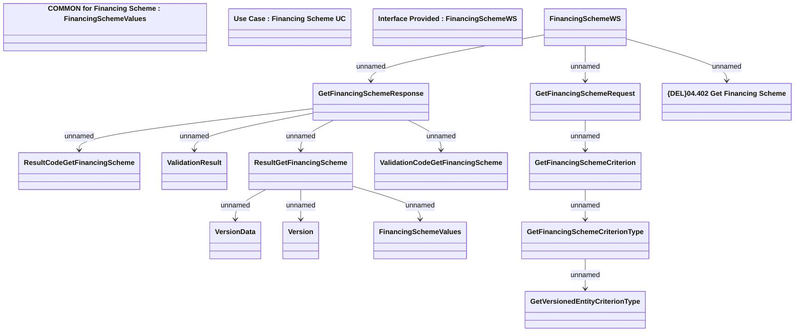

# GetFinancingScheme

```mermaid
classDiagram
    class GetVersionedEntityCriterionType["GetVersionedEntityCriterionType"]
    class ResultCodeGetFinancingScheme["ResultCodeGetFinancingScheme"]
    class ValidationResult["ValidationResult"]
    class VersionData["VersionData"]
    class COMMON_for_Financing_Scheme_FinancingSchemeValues["COMMON for Financing Scheme : FinancingSchemeValues"]
    class Version["Version"]
    class FinancingSchemeValues["FinancingSchemeValues"]
    class GetFinancingSchemeCriterionType["GetFinancingSchemeCriterionType"]
    class GetFinancingSchemeCriterion["GetFinancingSchemeCriterion"]
    class ValidationCodeGetFinancingScheme["ValidationCodeGetFinancingScheme"]
    class ResultGetFinancingScheme["ResultGetFinancingScheme"]
    class GetFinancingSchemeResponse["GetFinancingSchemeResponse"]
    class GetFinancingSchemeRequest["GetFinancingSchemeRequest"]
    class DEL_04_402_Get_Financing_Scheme["{DEL}04.402 Get Financing Scheme"]
    class Use_Case_Financing_Scheme_UC["Use Case : Financing Scheme UC"]
    class Interface_Provided_FinancingSchemeWS["Interface Provided : FinancingSchemeWS"]
    class FinancingSchemeWS["FinancingSchemeWS"]
    GetFinancingSchemeResponse --> ResultGetFinancingScheme : unnamed
    GetFinancingSchemeResponse --> ValidationCodeGetFinancingScheme : unnamed
    GetFinancingSchemeRequest --> GetFinancingSchemeCriterion : unnamed
    GetFinancingSchemeCriterion --> GetFinancingSchemeCriterionType : unnamed
    ResultGetFinancingScheme --> FinancingSchemeValues : unnamed
    ResultGetFinancingScheme --> Version : unnamed
    ResultGetFinancingScheme --> VersionData : unnamed
    GetFinancingSchemeResponse --> ValidationResult : unnamed
    GetFinancingSchemeResponse --> ResultCodeGetFinancingScheme : unnamed
    GetFinancingSchemeCriterionType --> GetVersionedEntityCriterionType : unnamed
    FinancingSchemeWS --> GetFinancingSchemeResponse : unnamed
    FinancingSchemeWS --> DEL_04_402_Get_Financing_Scheme : unnamed
    FinancingSchemeWS --> GetFinancingSchemeRequest : unnamed
```
