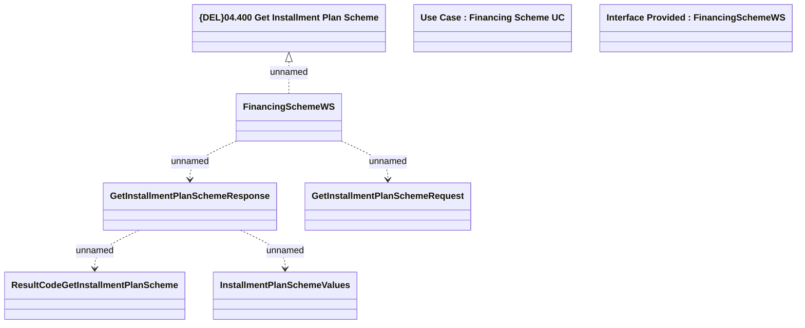

# GetInstallmentPlanScheme

- **Diagram Type**: Logical
- **Package**: HomerSelect/BSL/Modules/Product Catalog (PRC)/Analytical Model/Financing Scheme/Financing Scheme/Provided Services/Interface Provided/GetInstallmentPlanScheme
- **Diagram ID**: 98557
- **Elements**: 8
- **Connectors**: 5

