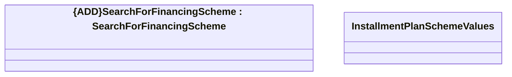

# InstallmentPlanSchemeValues

```mermaid
classDiagram
    class ADD_SearchForFinancingScheme_SearchForFinancingScheme["{ADD}SearchForFinancingScheme : SearchForFinancingScheme"]
    class InstallmentPlanSchemeValues["InstallmentPlanSchemeValues"]
```
