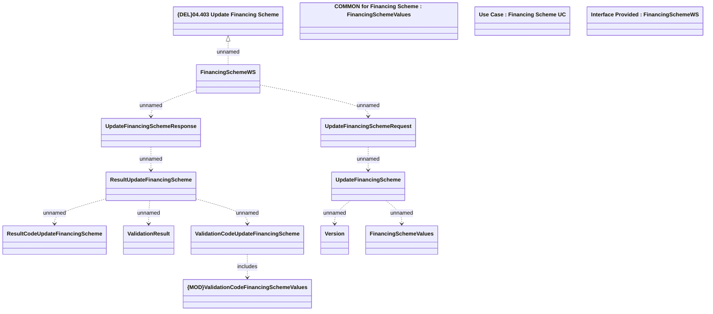

# UpdateFinancingScheme

- **Diagram Type**: Logical
- **Package**: HomerSelect/BSL/Modules/Product Catalog (PRC)/Analytical Model/Financing Scheme/Financing Scheme/Provided Services/Interface Provided/UpdateFinancingScheme
- **Diagram ID**: 102271
- **Elements**: 15
- **Connectors**: 11

