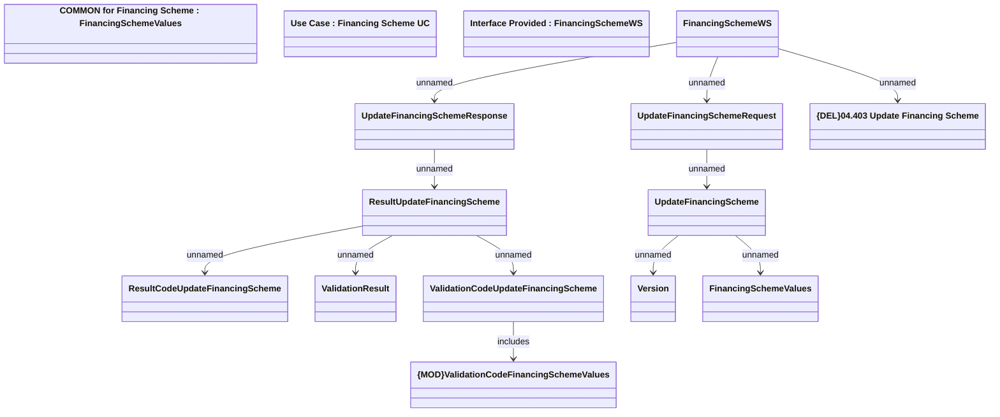

# UpdateFinancingScheme

```mermaid
classDiagram
    class ResultCodeUpdateFinancingScheme["ResultCodeUpdateFinancingScheme"]
    class ValidationResult["ValidationResult"]
    class ValidationCodeUpdateFinancingScheme["ValidationCodeUpdateFinancingScheme"]
    class ResultUpdateFinancingScheme["ResultUpdateFinancingScheme"]
    class UpdateFinancingSchemeResponse["UpdateFinancingSchemeResponse"]
    class UpdateFinancingScheme["UpdateFinancingScheme"]
    class UpdateFinancingSchemeRequest["UpdateFinancingSchemeRequest"]
    class DEL_04_403_Update_Financing_Scheme["{DEL}04.403 Update Financing Scheme"]
    class COMMON_for_Financing_Scheme_FinancingSchemeValues["COMMON for Financing Scheme : FinancingSchemeValues"]
    class Use_Case_Financing_Scheme_UC["Use Case : Financing Scheme UC"]
    class Interface_Provided_FinancingSchemeWS["Interface Provided : FinancingSchemeWS"]
    class Version["Version"]
    class MOD_ValidationCodeFinancingSchemeValues["{MOD}ValidationCodeFinancingSchemeValues"]
    class FinancingSchemeValues["FinancingSchemeValues"]
    class FinancingSchemeWS["FinancingSchemeWS"]
    UpdateFinancingScheme --> FinancingSchemeValues : unnamed
    ValidationCodeUpdateFinancingScheme --> MOD_ValidationCodeFinancingSchemeValues : includes
    UpdateFinancingScheme --> Version : unnamed
    UpdateFinancingSchemeRequest --> UpdateFinancingScheme : unnamed
    UpdateFinancingSchemeResponse --> ResultUpdateFinancingScheme : unnamed
    ResultUpdateFinancingScheme --> ValidationCodeUpdateFinancingScheme : unnamed
    ResultUpdateFinancingScheme --> ValidationResult : unnamed
    ResultUpdateFinancingScheme --> ResultCodeUpdateFinancingScheme : unnamed
    FinancingSchemeWS --> DEL_04_403_Update_Financing_Scheme : unnamed
    FinancingSchemeWS --> UpdateFinancingSchemeRequest : unnamed
    FinancingSchemeWS --> UpdateFinancingSchemeResponse : unnamed
```
