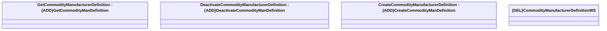

# CommodityManufacturerDefinitionWS

```mermaid
classDiagram
    class GetCommodityManufacturerDefinition_ADD_GetCommodityManDefini["GetCommodityManufacturerDefinition :{ADD}GetCommodityManDefinition"]
    class DeactivateCommodityManufacturerDefinition_ADD_DeactivateComm["DeactivateCommodityManufacturerDefinition :{ADD}DeactivateCommodityManDefinition"]
    class CreateCommodityManufacturerDefinition_ADD_CreateCommodityMan["CreateCommodityManufacturerDefinition :{ADD}CreateCommodityManDefinition"]
    class DEL_CommodityManufacturerDefinitionWS["{DEL}CommodityManufacturerDefinitionWS"]
```
