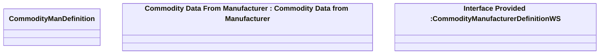

# Common for Commodity Manufacturer Definition

```mermaid
classDiagram
    class CommodityManDefinition["CommodityManDefinition"]
    class Commodity_Data_From_Manufacturer_Commodity_Data_from_Manufac["Commodity Data From Manufacturer : Commodity Data from Manufacturer"]
    class Interface_Provided_CommodityManufacturerDefinitionWS["Interface Provided :CommodityManufacturerDefinitionWS"]
```
