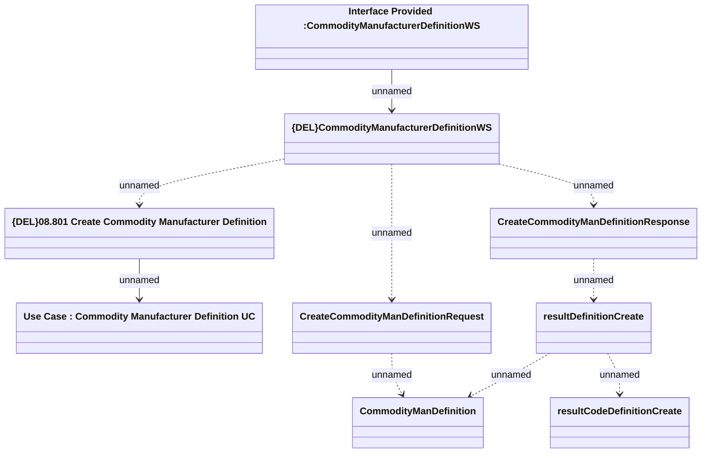

# {ADD}CreateCommodityManDefinition

- **Diagram Type**: Logical
- **Package**: HomerSelect/BSL/Modules/Product Catalog (PRC)/Analytical Model/Model mapper/Interface Provided/{ADD}CreateCommodityManDefinition
- **Diagram ID**: 111143
- **Elements**: 9
- **Connectors**: 9

