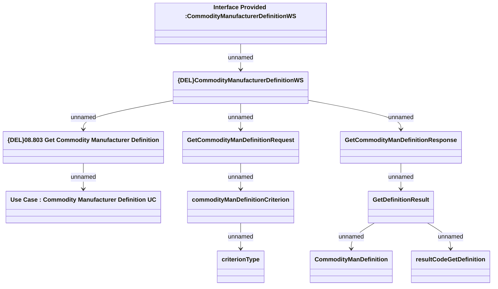

# {ADD}GetCommodityManDefinition

```mermaid
classDiagram
    class Use_Case_Commodity_Manufacturer_Definition_UC["Use Case : Commodity Manufacturer Definition UC"]
    class DEL_08_803_Get_Commodity_Manufacturer_Definition["{DEL}08.803 Get Commodity Manufacturer Definition"]
    class resultCodeGetDefinition["resultCodeGetDefinition"]
    class CommodityManDefinition["CommodityManDefinition"]
    class GetDefinitionResult["GetDefinitionResult"]
    class GetCommodityManDefinitionResponse["GetCommodityManDefinitionResponse"]
    class criterionType["criterionType"]
    class commodityManDefinitionCriterion["commodityManDefinitionCriterion"]
    class GetCommodityManDefinitionRequest["GetCommodityManDefinitionRequest"]
    class Interface_Provided_CommodityManufacturerDefinitionWS["Interface Provided :CommodityManufacturerDefinitionWS"]
    class DEL_CommodityManufacturerDefinitionWS["{DEL}CommodityManufacturerDefinitionWS"]
    Interface_Provided_CommodityManufacturerDefinitionWS --> DEL_CommodityManufacturerDefinitionWS : unnamed
    GetCommodityManDefinitionRequest --> commodityManDefinitionCriterion : unnamed
    commodityManDefinitionCriterion --> criterionType : unnamed
    GetCommodityManDefinitionResponse --> GetDefinitionResult : unnamed
    GetDefinitionResult --> CommodityManDefinition : unnamed
    GetDefinitionResult --> resultCodeGetDefinition : unnamed
    DEL_CommodityManufacturerDefinitionWS --> GetCommodityManDefinitionRequest : unnamed
    DEL_CommodityManufacturerDefinitionWS --> DEL_08_803_Get_Commodity_Manufacturer_Definition : unnamed
    DEL_CommodityManufacturerDefinitionWS --> GetCommodityManDefinitionResponse : unnamed
    DEL_08_803_Get_Commodity_Manufacturer_Definition --> Use_Case_Commodity_Manufacturer_Definition_UC : unnamed
```
