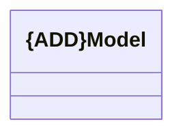

# Model Management

- **Diagram Type**: Logical
- **Package**: HomerSelect/BSL/Modules/Product Catalog (PRC)/Analytical Model/Model/COMMON for Product/Logical Data Model
- **Diagram ID**: 140875
- **Elements**: 1
- **Connectors**: 0

