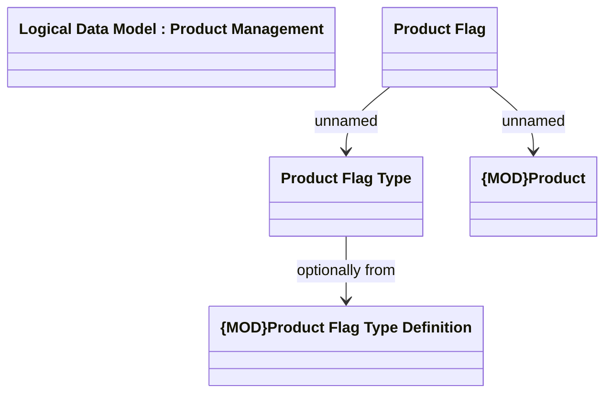

# Product - Flags

```mermaid
classDiagram
    class Product_Flag_Type["Product Flag Type"]
    class Logical_Data_Model_Product_Management["Logical Data Model : Product Management"]
    class MOD_Product["{MOD}Product"]
    class MOD_Product_Flag_Type_Definition["{MOD}Product Flag Type Definition"]
    class Product_Flag["Product Flag"]
    Product_Flag_Type --> MOD_Product_Flag_Type_Definition : optionally from
    Product_Flag --> MOD_Product : unnamed
    Product_Flag --> Product_Flag_Type : unnamed
```
