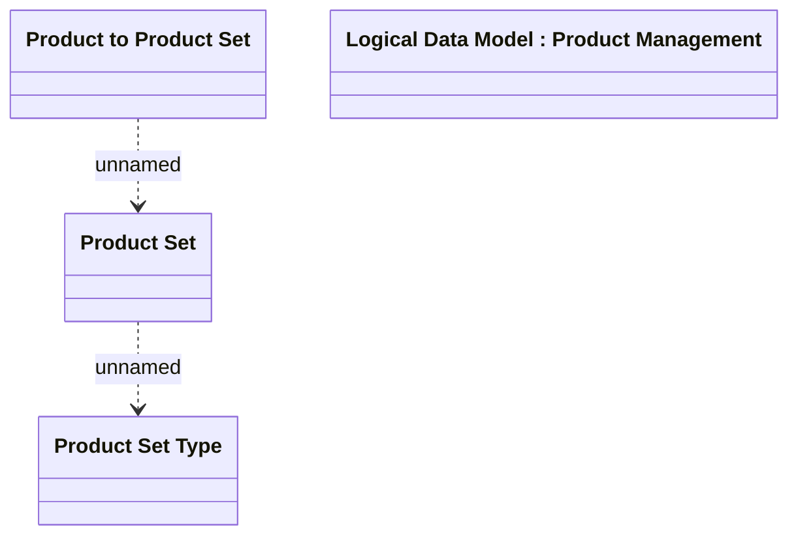

# Product - Sets

- **Diagram Type**: Logical
- **Package**: HomerSelect/BSL/Modules/Product Catalog (PRC)/Analytical Model/Product/COMMON for Product/Logical Data Model
- **Diagram ID**: 164446
- **Elements**: 4
- **Connectors**: 2

