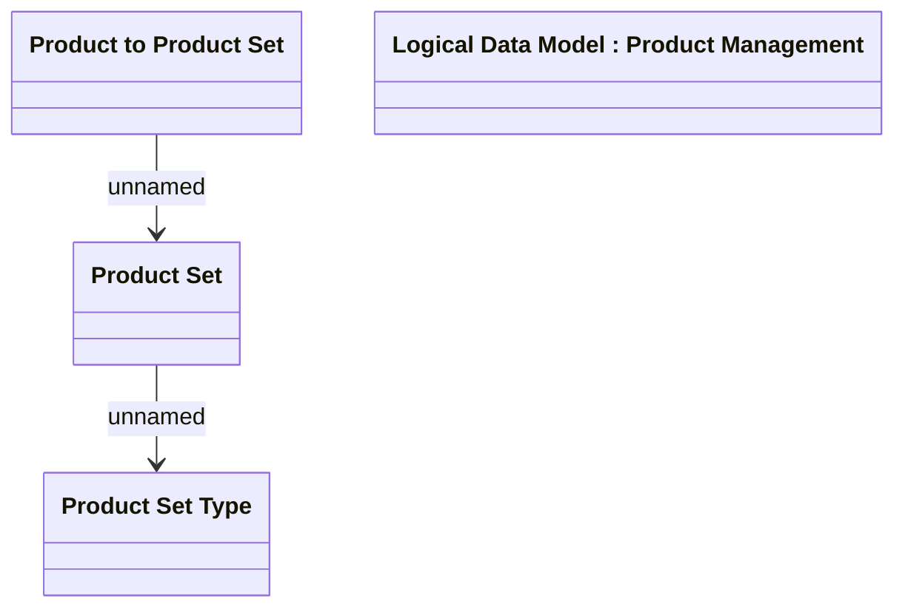

# Product - Sets

```mermaid
classDiagram
    class Product_Set_Type["Product Set Type"]
    class Product_Set["Product Set"]
    class Product_to_Product_Set["Product to Product Set"]
    class Logical_Data_Model_Product_Management["Logical Data Model : Product Management"]
    Product_to_Product_Set --> Product_Set : unnamed
    Product_Set --> Product_Set_Type : unnamed
```
