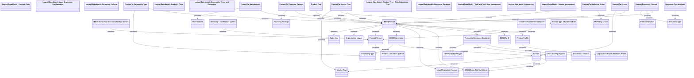

# Product Management

```mermaid
classDiagram
    class MOD_Standalone_Insurance_Product_Variant["{MOD}Standalone Insurance Product Variant"]
    class IS_generation_trigger["IS generation trigger"]
    class Logical_Data_Model_Product_Sets["Logical Data Model : Product - Sets"]
    class Client_Scoring_Segment["Client Scoring Segment"]
    class Logical_Data_Model_Loan_Origination_Configuration["Logical Data Model : Loan Origination Configuration"]
    class Loan_Origination_Process["Loan Origination Process"]
    class Logical_Data_Model_Financing_Package["Logical Data Model : Financing Package"]
    class Financing_Package["Financing Package"]
    class Product_To_Financing_Package["Product To Financing Package"]
    class Logical_Data_Model_Product_Flags["Logical Data Model : Product - Flags"]
    class MOD_Subvention["{MOD}Subvention"]
    class Logical_Data_Model_Commodity_Types_and_Categories["Logical Data Model : Commodity Types and Categories"]
    class Commodity_Type["Commodity Type"]
    class Product_To_Commodity_Type["Product To Commodity Type"]
    class Product_To_Marketing_Action["Product To Marketing Action"]
    class Product_To_Manufacturer["Product To Manufacturer"]
    class Product_Flag["Product Flag"]
    class Logical_Data_Model_Product_Type_Offer_Calculation_Type["Logical Data Model : Product Type - Offer Calculation Type"]
    class n_2SP_Block_of_Data_Type["2SP Block of Data Type"]
    class Sales_Area["Sales Area"]
    class Logical_Data_Model_Document_Container["Logical Data Model : Document Container"]
    class Manufacturer["Manufacturer"]
    class Logical_Data_Model_Tariff_and_Tariff_Item_Management["Logical Data Model : Tariff and Tariff Item Management"]
    class Revolving_Loan_Product_Variant["Revolving Loan Product Variant"]
    class Logical_Data_Model_Subventions["Logical Data Model :Subventions"]
    class Logical_Data_Model_Service_Management["Logical Data Model : Service Management"]
    class Logical_Data_Model_Product_Profile["Logical Data Model : Product - Profile"]
    class Product_Calculation_Method["Product Calculation Method"]
    class Service_Type_Adjustment_Rule["Service Type Adjustment Rule"]
    class Product_To_Service_Type["Product To Service Type"]
    class Service_Type["Service Type"]
    class Service["Service"]
    class Product_To_Service["Product To Service"]
    class Product_Variant["Product Variant"]
    class MOD_Product["{MOD}Product"]
    class Product_Document_Printout["Product Document Printout"]
    class Document_Type_Attribute["Document Type Attribute"]
    class MOD_Terms_And_Conditions["{MOD}Terms And Conditions"]
    class Marketing_Action["Marketing Action"]
    class Closed_End_Loan_Product_Variant["Closed End Loan Product Variant"]
    class MOD_Tariff["{MOD}Tariff"]
    class Product_to_Document_Container["Product to Document Container"]
    class Printout_Template["Printout Template"]
    class Document_Type["Document Type"]
    class Document_Container["Document Container"]
    class Product_Profile["Product Profile"]
    Service --> Service_Type : unnamed
    Service --> Loan_Origination_Process : unnamed
    Service --> MOD_Terms_And_Conditions : unnamed
    MOD_Product --> Sales_Area : unnamed
    MOD_Product --> IS_generation_trigger : unnamed
    Closed_End_Loan_Product_Variant --> Product_Variant : unnamed
    Product_To_Service --> Service : unnamed
    Product_To_Service_Type --> Service_Type : unnamed
    Product_To_Service_Type --> Service_Type_Adjustment_Rule : unnamed
    Product_Variant --> Product_Calculation_Method : unnamed
    MOD_Product --> Product_Variant : unnamed
    Product_To_Manufacturer --> Manufacturer : unnamed
    MOD_Standalone_Insurance_Product_Variant --> Product_Variant : unnamed
    Product_to_Document_Container --> n_2SP_Block_of_Data_Type : unnamed
    Product_To_Commodity_Type --> Commodity_Type : unnamed
    MOD_Subvention --> Commodity_Type : unnamed
    MOD_Product --> MOD_Subvention : unnamed
    Product_To_Financing_Package --> Financing_Package : unnamed
    MOD_Product --> Loan_Origination_Process : unnamed
    Product_to_Document_Container --> Client_Scoring_Segment : unnamed
    Product_Profile --> Logical_Data_Model_Product_Profile : unnamed
    MOD_Product --> MOD_Terms_And_Conditions : unnamed
    Product_to_Document_Container --> Document_Container : unnamed
    Document_Type_Attribute --> Document_Type : unnamed
    Product_Document_Printout --> Document_Type : unnamed
    Product_Document_Printout --> Printout_Template : unnamed
    MOD_Product --> Product_to_Document_Container : unnamed
    MOD_Product --> MOD_Tariff : unnamed
    Revolving_Loan_Product_Variant --> Product_Variant : unnamed
    MOD_Product --> Product_Profile : unnamed
    Product_To_Service --> MOD_Product : unnamed
    Product_To_Service_Type --> MOD_Product : unnamed
    Product_Flag --> MOD_Product : unnamed
    Product_To_Manufacturer --> MOD_Product : unnamed
    Product_To_Marketing_Action --> MOD_Product : unnamed
    Product_To_Commodity_Type --> MOD_Product : unnamed
    Product_Document_Printout --> MOD_Product : unnamed
    Product_To_Financing_Package --> MOD_Product : unnamed
    Product_To_Marketing_Action --> Marketing_Action : unnamed
    MOD_Subvention --> Service : unnamed
```
