# Product Profile

- **Diagram Type**: Logical
- **Package**: HomerSelect/BSL/Modules/Product Catalog (PRC)/Analytical Model/Product/COMMON for Product/Logical Data Model
- **Diagram ID**: 164441
- **Elements**: 22
- **Connectors**: 17

```mermaid
classDiagram
    class Day_Count_Method_Type["Day Count Method Type"]
    class Business_Category["Business Category"]
    class AF_configuration_AF_configuration["AF configuration : AF configuration"]
    class Documentation_Configuration_Documentation_Configuration["Documentation Configuration : Documentation Configuration"]
    class Product_Profile_2_Documentation_Configuration["Product Profile 2 Documentation Configuration"]
    class Documentation_Configuration["Documentation Configuration"]
    class Product_Profile_2_Product_Set["Product Profile 2 Product Set"]
    class Product_Profile_2_Application_Form_Configuration["Product Profile 2 Application Form Configuration"]
    class Application_Form_Configuration["Application Form Configuration"]
    class Logical_Data_Model_Product_Profile_Document_Rules["Logical Data Model : Product Profile - Document Rules"]
    class First_Day_of_Billing_Period_Algorithm_Type["First Day of Billing Period Algorithm Type"]
    class Product_Set["Product Set"]
    class Product_Profile_Installment_Schedule["Product Profile Installment Schedule"]
    class Product_Transaction_Type["Product Transaction Type"]
    class Logical_Data_Model_Product_Management["Logical Data Model : Product Management"]
    class Contract_Negotiation_Process_Type["Contract Negotiation Process Type"]
    class First_Due_Date_Algorithm_Type["First Due Date Algorithm Type"]
    class MOD_Installment_Schedule_Method_Type["{MOD}Installment Schedule Method Type"]
    class Accounting_Method["Accounting Method"]
    class Product_Type["Product Type"]
    class MOD_Product["{MOD}Product"]
    class Product_Profile["Product Profile"]
    Product_Profile_Installment_Schedule ..> MOD_Installment_Schedule_Method_Type : unnamed
    Product_Profile ..> Business_Category : unnamed
    Product_Profile_2_Documentation_Configuration ..> Documentation_Configuration : unnamed
    Product_Profile_2_Application_Form_Configuration ..> Application_Form_Configuration : unnamed
    Product_Profile ..> First_Day_of_Billing_Period_Algorithm_Type : unnamed
    Product_Profile_2_Product_Set ..> Product_Set : unnamed
    Product_Profile ..> Product_Transaction_Type : unnamed
    Product_Profile ..> Day_Count_Method_Type : unnamed
    Product_Profile ..> First_Due_Date_Algorithm_Type : unnamed
    Product_Profile o-- Product_Profile_Installment_Schedule : unnamed
    Product_Profile ..> Accounting_Method : unnamed
    Product_Profile ..> Product_Type : unnamed
    MOD_Product --> Product_Profile : unnamed
    Product_Profile o-- Product_Profile_2_Application_Form_Configuration : unnamed
    Product_Profile o-- Product_Profile_2_Product_Set : unnamed
    Product_Profile o-- Product_Profile_2_Documentation_Configuration : unnamed
    Product_Profile ..> Contract_Negotiation_Process_Type : unnamed
```

