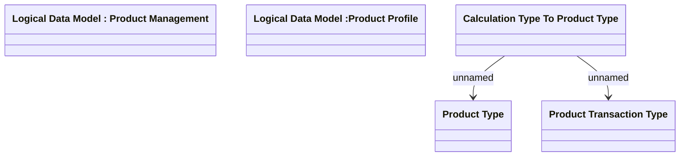

# Product Type - Offer Calculation Type

```mermaid
classDiagram
    class Logical_Data_Model_Product_Management["Logical Data Model : Product Management"]
    class Logical_Data_Model_Product_Profile["Logical Data Model :Product Profile"]
    class Product_Transaction_Type["Product Transaction Type"]
    class Calculation_Type_To_Product_Type["Calculation Type To Product Type "]
    class Product_Type["Product Type"]
    Calculation_Type_To_Product_Type --> Product_Type : unnamed
    Calculation_Type_To_Product_Type --> Product_Transaction_Type : unnamed
```
