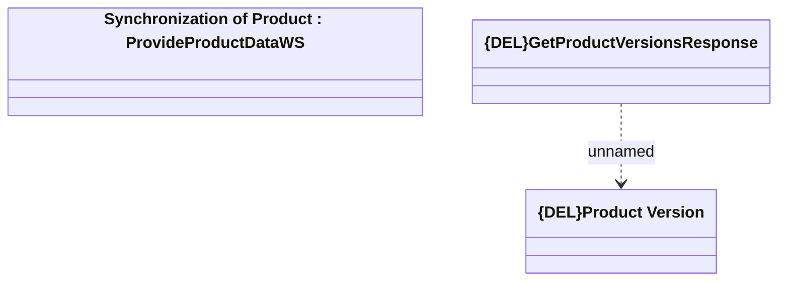

# Product Versions

- **Diagram Type**: Logical
- **Package**: HomerSelect/BSL/Modules/Product Catalog (PRC)/Analytical Model/Product/Provided Services/Interface Provided/ProvideProductDataWS/Product Versions
- **Diagram ID**: 162475
- **Elements**: 3
- **Connectors**: 1

