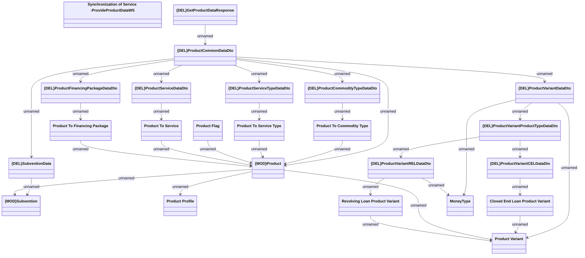

# Product data synchronization mapping

```mermaid
classDiagram
    class MOD_Subvention["{MOD}Subvention"]
    class DEL_SubventionData["{DEL}SubventionData"]
    class DEL_ProductFinancingPackageDataDto["{DEL}ProductFinancingPackageDataDto"]
    class Product_To_Financing_Package["Product To Financing Package"]
    class DEL_ProductServiceTypeDataDto["{DEL}ProductServiceTypeDataDto"]
    class Product_To_Service_Type["Product To Service Type"]
    class Product_Variant["Product Variant"]
    class Product_Flag["Product Flag"]
    class Product_To_Commodity_Type["Product To Commodity Type"]
    class Product_Profile["Product Profile"]
    class Revolving_Loan_Product_Variant["Revolving Loan Product Variant"]
    class Closed_End_Loan_Product_Variant["Closed End Loan Product Variant"]
    class MoneyType["MoneyType"]
    class DEL_ProductCommodityTypeDataDto["{DEL}ProductCommodityTypeDataDto"]
    class DEL_ProductVariantDataDto["{DEL}ProductVariantDataDto"]
    class Product_To_Service["Product To Service"]
    class DEL_ProductServiceDataDto["{DEL}ProductServiceDataDto"]
    class MOD_Product["{MOD}Product"]
    class DEL_ProductVariantCELDataDto["{DEL}ProductVariantCELDataDto"]
    class DEL_ProductVariantProductTypeDataDto["{DEL}ProductVariantProductTypeDataDto"]
    class DEL_ProductVariantRELDataDto["{DEL}ProductVariantRELDataDto"]
    class DEL_ProductCommonDataDto["{DEL}ProductCommonDataDto"]
    class Synchronization_of_Service_ProvideProductDataWS["Synchronization of Service :ProvideProductDataWS"]
    class DEL_GetProductDataResponse["{DEL}GetProductDataResponse"]
    DEL_ProductVariantCELDataDto --> Closed_End_Loan_Product_Variant : unnamed
    DEL_ProductVariantRELDataDto --> Revolving_Loan_Product_Variant : unnamed
    DEL_ProductCommodityTypeDataDto --> Product_To_Commodity_Type : unnamed
    DEL_ProductServiceTypeDataDto --> Product_To_Service_Type : unnamed
    DEL_ProductCommonDataDto --> DEL_ProductServiceTypeDataDto : unnamed
    DEL_ProductFinancingPackageDataDto --> Product_To_Financing_Package : unnamed
    DEL_ProductCommonDataDto --> DEL_ProductFinancingPackageDataDto : unnamed
    DEL_ProductCommonDataDto --> DEL_SubventionData : unnamed
    DEL_SubventionData --> MOD_Subvention : unnamed
    DEL_ProductVariantDataDto --> Product_Variant : unnamed
    DEL_ProductVariantProductTypeDataDto --> DEL_ProductVariantRELDataDto : unnamed
    DEL_ProductVariantDataDto --> DEL_ProductVariantProductTypeDataDto : unnamed
    DEL_ProductVariantProductTypeDataDto --> DEL_ProductVariantCELDataDto : unnamed
    DEL_ProductCommonDataDto --> MOD_Product : unnamed
    DEL_ProductVariantDataDto --> MoneyType : unnamed
    DEL_ProductCommonDataDto --> DEL_ProductServiceDataDto : unnamed
    DEL_ProductServiceDataDto --> Product_To_Service : unnamed
    DEL_ProductCommonDataDto --> DEL_ProductVariantDataDto : unnamed
    DEL_ProductCommonDataDto --> DEL_ProductCommodityTypeDataDto : unnamed
    DEL_ProductVariantRELDataDto --> MoneyType : unnamed
    DEL_GetProductDataResponse --> DEL_ProductCommonDataDto : unnamed
    Closed_End_Loan_Product_Variant --> Product_Variant : unnamed
    Product_To_Commodity_Type --> MOD_Product : unnamed
    Product_To_Service_Type --> MOD_Product : unnamed
    MOD_Product --> Product_Variant : unnamed
    Revolving_Loan_Product_Variant --> Product_Variant : unnamed
    Product_Flag --> MOD_Product : unnamed
    Product_To_Service --> MOD_Product : unnamed
    MOD_Product --> Product_Profile : unnamed
    Product_To_Financing_Package --> MOD_Product : unnamed
    MOD_Product --> MOD_Subvention : unnamed
```
