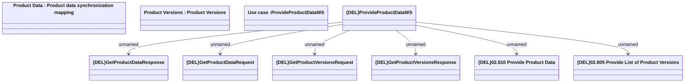

# ProvideProductDataWS

```mermaid
classDiagram
    class Product_Data_Product_data_synchronization_mapping["Product Data : Product data synchronization mapping"]
    class Product_Versions_Product_Versions["Product Versions : Product Versions"]
    class Use_case_ProvideProductDataWS["Use case :ProvideProductDataWS"]
    class DEL_02_805_Provide_List_of_Product_Versions["{DEL}02.805 Provide List of Product Versions"]
    class DEL_02_810_Provide_Product_Data["{DEL}02.810 Provide Product Data"]
    class DEL_GetProductVersionsResponse["{DEL}GetProductVersionsResponse"]
    class DEL_GetProductVersionsRequest["{DEL}GetProductVersionsRequest"]
    class DEL_GetProductDataRequest["{DEL}GetProductDataRequest"]
    class DEL_GetProductDataResponse["{DEL}GetProductDataResponse"]
    class DEL_ProvideProductDataWS["{DEL}ProvideProductDataWS"]
    DEL_ProvideProductDataWS --> DEL_GetProductDataResponse : unnamed
    DEL_ProvideProductDataWS --> DEL_GetProductDataRequest : unnamed
    DEL_ProvideProductDataWS --> DEL_GetProductVersionsRequest : unnamed
    DEL_ProvideProductDataWS --> DEL_GetProductVersionsResponse : unnamed
    DEL_ProvideProductDataWS --> DEL_02_810_Provide_Product_Data : unnamed
    DEL_ProvideProductDataWS --> DEL_02_805_Provide_List_of_Product_Versions : unnamed
```
