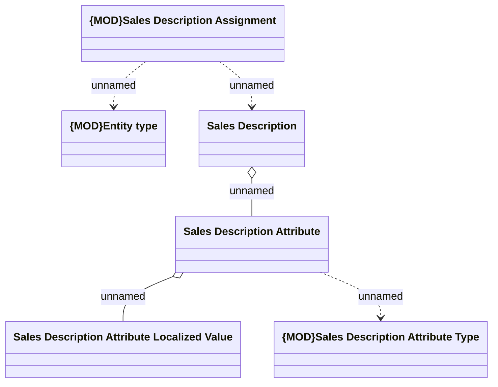

# Sales Description Structure

- **Diagram Type**: Logical
- **Package**: HomerSelect/BSL/Modules/Product Catalog (PRC)/Analytical Model/Sales Description/COMMON for Sales Description/Logical Data Model
- **Diagram ID**: 161078
- **Elements**: 6
- **Connectors**: 5

