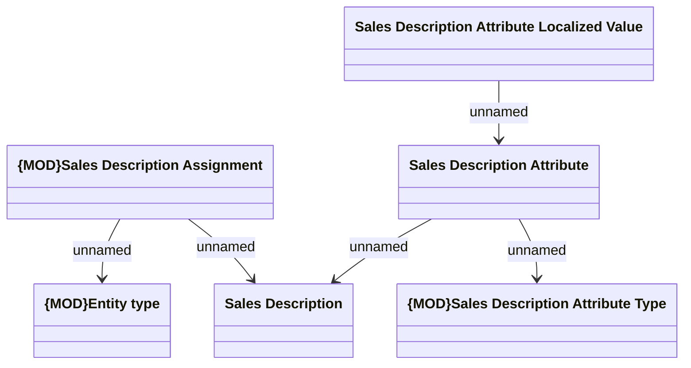

# Sales Description Structure

```mermaid
classDiagram
    class Sales_Description_Attribute_Localized_Value["Sales Description Attribute Localized Value"]
    class MOD_Entity_type["{MOD}Entity type"]
    class MOD_Sales_Description_Assignment["{MOD}Sales Description Assignment"]
    class MOD_Sales_Description_Attribute_Type["{MOD}Sales Description Attribute Type"]
    class Sales_Description_Attribute["Sales Description Attribute"]
    class Sales_Description["Sales Description"]
    MOD_Sales_Description_Assignment --> Sales_Description : unnamed
    Sales_Description_Attribute --> Sales_Description : unnamed
    Sales_Description_Attribute_Localized_Value --> Sales_Description_Attribute : unnamed
    Sales_Description_Attribute --> MOD_Sales_Description_Attribute_Type : unnamed
    MOD_Sales_Description_Assignment --> MOD_Entity_type : unnamed
```
