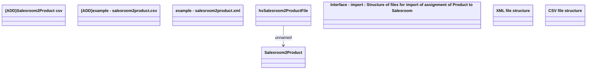

# Import file

```mermaid
classDiagram
    class ADD_Salesroom2Product_csv["{ADD}Salesroom2Product csv"]
    class ADD_example_salesroom2product_csv["{ADD}example - salesroom2product.csv"]
    class example_salesroom2product_xml["example - salesroom2product.xml"]
    class hsSalesroom2ProductFile["hsSalesroom2ProductFile"]
    class Salesroom2Product["Salesroom2Product"]
    class Interface_import_Structure_of_files_for_import_of_assignment["Interface - import : Structure of files for import of assignment of Product to Salesroom"]
    class XML_file_structure["XML file structure"]
    class CSV_file_structure["CSV file structure"]
    hsSalesroom2ProductFile --> Salesroom2Product : unnamed
```
