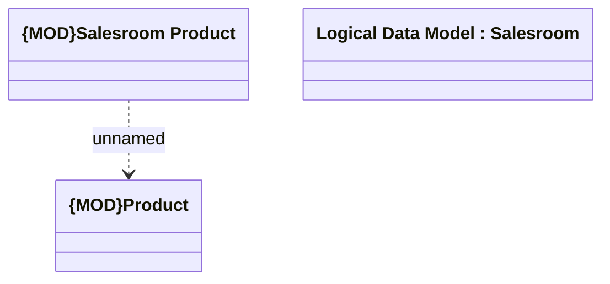

# Salesroom to product

- **Diagram Type**: Logical
- **Package**: HomerSelect/BSL/Modules/Product Catalog (PRC)/Analytical Model/Salesroom/Logical Data Model
- **Diagram ID**: 163503
- **Elements**: 3
- **Connectors**: 1

